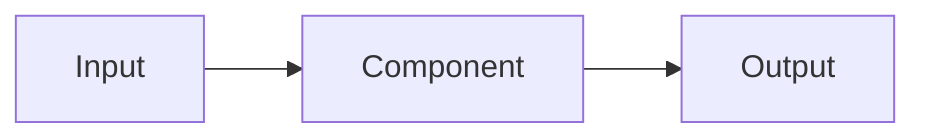

# 02 — Design

**Status:** draft | approved
**Requirements covered:** RF-01 … RF-NN
**Last updated:** YYYY-MM-DD

## 1. Architecture

Short description of each component and its responsibility.

## 2. Technical decisions
Every non-obvious choice references an ADR in `docs/adr/`.

| Decision | Choice | Alternatives rejected | ADR |
|----------|--------|-----------------------|-----|
| Core technique | ... | ... | ADR-001 |
| Model(s) | ... | ... | ADR-002 |
| Storage / retrieval | ... | ... | ADR-003 |

## 3. Data
- Sources, licences, size.
- Preparation pipeline (script names in `scripts/`).
- Splits: train / dev / test, how leakage is prevented.

## 4. Module contracts
Public interfaces between modules. Pydantic models and function signatures, not implementations.

```python
class Query(BaseModel): ...
def retrieve(q: Query, k: int) -> list[Chunk]: ...
```

## 5. Evaluation plan
| Milestone | What is measured | Dataset | Metric | Threshold |
|-----------|------------------|---------|--------|-----------|
| H1 | ... | dev.jsonl | ... | ... |

Deterministic scoring preferred. If an LLM judge is used: which model, prompt in `evals/judges/`, calibration set size and agreement with human labels.

## 6. Observability
What is traced in Langfuse (spans, metadata, cost), and what a run's result JSON contains.

## 7. Risks
| Risk | Likelihood | Impact | Mitigation |
|------|------------|--------|------------|
